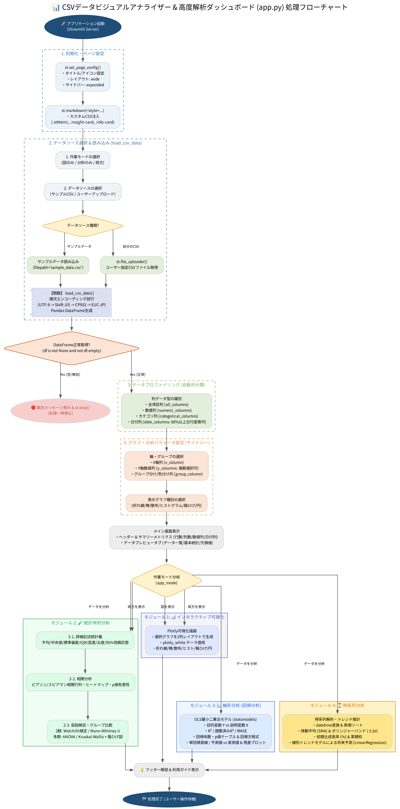
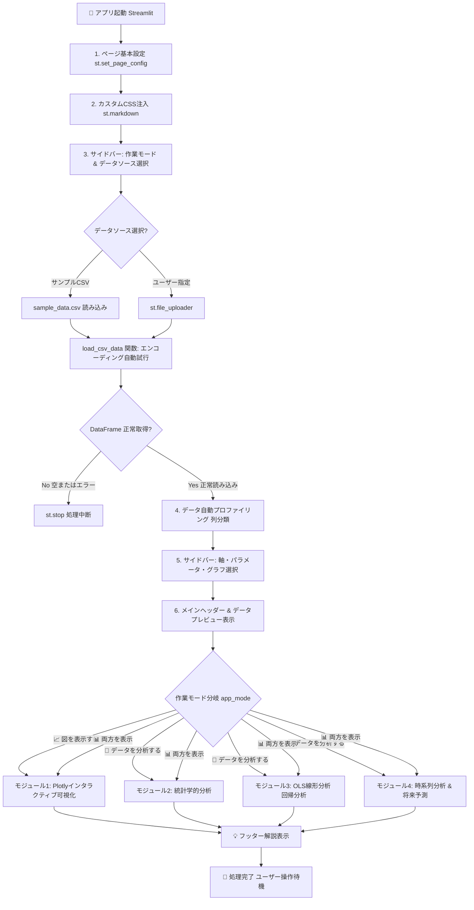

# 📊 app.py プログラム処理フローチャート & 構造解説書

本ドキュメントは、StreamlitベースのCSVデータ解析Webアプリケーション [`app.py`](file:///home/wakkii/PythonProjects/csv_view/app.py) の処理フローをビジュアルダイアグラムおよび詳細なステップ表で定義した設計仕様書です。

---

## 1. ビジュアルフローチャート (全体構成図)

---

## 2. Mermaid フローチャートダイアグラム

---

## 3. 処理フェーズ別 詳細説明一覧

| ステップ | 処理フェーズ | 該当コード範囲 | 処理内容と使用ライブラリ / ロジック |
| :--- | :--- | :--- | :--- |
| **Step 1** | **初期化 & ページ設定** | L40 - L80 | `st.set_page_config()` でワイド表示設定。 `st.markdown()` でカスタムCSSを注入（`.stMetric`, `.insight-card`, `.info-card` 等の装飾）。 |
| **Step 2** | **データ読み込み処理** | L86 - L120 | `load_csv_data()` 関数。 日本語環境の文字化け防止のため `UTF-8` → `Shift-JIS` → `CP932` → `EUC-JP` の順で `pd.read_csv()` を自動順次試行。 |
| **Step 3** | **サイドバーUI制御** | L125 - L167 | 作業モード（可視化/分析/両方）およびデータソース（サンプルデータ/ユーザーアップロード）の受付。 |
| **Step 4** | **データ判定ガード** | L169 - L172 | `df is None or df.empty` の場合、エラーメッセージを表示して `st.stop()` で後続処理をストップ。 |
| **Step 5** | **データプロファイリング** | L176 - L193 | 読み込まれたDataFrameの各列を型分類（全列、数値列、カテゴリ列）。 60%以上の行が日付変換可能な列を `date_columns` として自動識別。 |
| **Step 6** | **軸 & パラメータ設定** | L198 - L243 | サイドバーでX軸、Y軸（複数可）、グループ分け列を設定。 図表示モードの場合は表示するグラフ種類（折れ線/棒/散布/ヒスト/箱ひげ/円）をチェックボックスで受領。 |
| **Step 7** | **メイン画面 & プレビュー** | L248 - L278 | サマリーメトリクス（総レコード数、列数等）を表示。 タブ切替で「データプレビュー」「基本記述統計サマリー」「欠損値チェック」を表示。 |
| **Step 8** | **モジュール動的タブ分岐** | L283 - L300 | ユーザーが指定した `app_mode` に応じてメイン画面のタブコンポーネントを動的に生成。 |
| **Step 9-1**| **【モジュール1】可視化** | L307 - L399 | `Plotly` によるインタラクティブグラフ描画（`plotly_white` テーマ）。2列グリッド配置で各種グラフを動的レンダリング。 |
| **Step 9-2**| **【モジュール2】統計分析** | L404 - L573 | `scipy.stats` を活用。 ・**サブタブ2-1**: 詳細記述統計量（信頼区間、歪度、尖度） ・**サブタブ2-2**: ピアソン/スピアマン相関ヒートマップ & p値判定 ・**サブタブ2-3**: 仮説検定（2群: t検定/Mann-Whitney U、多群: ANOVA/Kruskal-Wallis） |
| **Step 9-3**| **【モジュール3】線形分析** | L578 - L685 | `statsmodels.api` OLS最小二乗法回帰分析。 決定係数 $R^2$、RMSE、回帰係数・p値テーブル、自動方程式生成、回帰直線 & 残差プロット描画。 |
| **Step 9-4**| **【モジュール4】時系列分析** | L690 - L822 | `scikit-learn LinearRegression` ＆ `pandas`。 ・移動平均（SMA）＆ ボリンジャーバンド（$\pm 2\sigma$） ・前期比成長率（%）＆ 累積和 ・線形トレンド推計による将来予測グラフ＆データテーブル出力。 |
| **Step 10** | **フッター表示 & 完了** | L827 - L835 | アプリの利用ガイドフッターを出力し、ユーザーの次のインタラクション待機状態へ遷移。 |

---

## 4. 関連ファイル
- 📜 Pythonメインコード: [`app.py`](file:///home/wakkii/PythonProjects/csv_view/app.py)
- 📄 Word形式解説書: [`app_flowchart.docx`](file:///home/wakkii/PythonProjects/csv_view/app_flowchart.docx)
- 🎨 高解像度フローチャート画像: [`app_flowchart.png`](file:///home/wakkii/PythonProjects/csv_view/app_flowchart.png)
